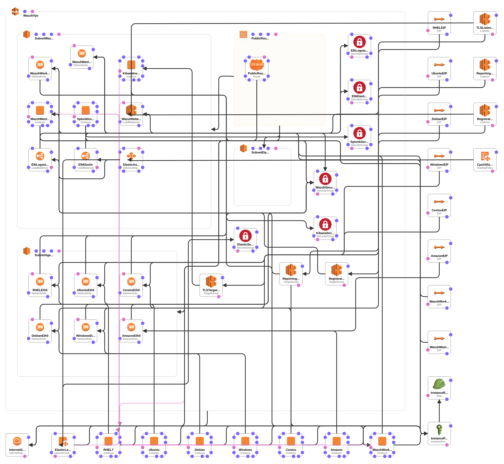

# Wazuh for Amazon AWS Cloudformation

The template and scripts here set up an environment that includes:

* A VPC with two subnets, one for Wazuh servers, and another for Elastic Stack
* Wazuh managers cluster with two nodes, a master and a worker
* An Elasticsearch cluster with a minimum of 3 data nodes, auto-scalable to a maximum of 6 nodes
* A Kibana node that includes a local elasticsearch client node, and an Nginx for HTTP basic authentication
* Wazuh servers seat behind an internet-facing load balancer for agents to communicate with the cluster
* Kibana server seats behind an internet facing load balancer, that optionally loads an SSL Certificate for HTTPS
* A Splunk Indexer instance with a Splunk app for Wazuh installed on it.
* Six Wazuh agents installed on different operating systems: Red Hat 7, CentOS 7, Ubuntu, Debian, Amazon Linux and Windows.

## Elasticsearch cluster configuration

Elasticsearch data nodes are deployed as part of an auto scaling group, that scales based on CPU usage. Minimum number of nodes is 3, and maximum is 6.

Elasticsearch instance types can be chosen from:

* i3.large
* i3.xlarge
* i3.2xlarge
* t2.large
* t2.medium

These instance types are recommended due to Elasticsearch disk requirements. Ephemeral disks are used for data storage.

None of these instances are directly accessible from the Internet, although they can be reached jumping through the Kibana system, that has a public SSH service.

## Kibana server configuration

Kibana server runs an instance of Elasticsearch (acting as a client node), an instance of Kibana (with Wazuh plugin installed and configured), and an instance of Nginx (used to provide SSL encryption and basic HTTP authentication).

Kibana instance types can be chosen from:

* m5.large
* m5.xlarge
* m5.2xlarge
* t2.large
* t2.medium
* r5.large

These instance types are recommended due to Kibana and Elasticsearch memory requirements.

In addition, the Kibana server takes care of:

* Setting up wazuh-alerts template in Elasticsearch
* Setting default index-pattern to wazuh-alerts
* Setting default time-picker to 24 hours

Kibana server is reachable from the Internet, directly via its own Elastic IP, or through an internet-facing load balancer. The load balancer can be used, optionally, to add a valid Amazon SSL Certificate for HTTPS communications.

## Wazuh cluster configuration

The Wazuh cluster deployed has one master node (providing API and registration server) and one worker node.

Wazuh instance types can be chosen from:

* m5.large
* m5.xlarge
* m5.2xlarge
* t2.micro
* t2.medium
* t2.large

These instance types are recommended for the managers, as they provide enough memory for Wazuh components.

The Wazuh API, running on Wazuh master node, is automatically configured to use HTTPS protocol.

The Wazuh registration service (authd), running on Wazuh master node, is configured not to use source IP addresses. We assume that agents will connect through the Internet, and most likely several will use the same source IP (sitting behind a NAT). This service is configured automatically to require password authentication for new agents registration.

Filebeat runs on both the Wazuh master node and the worker node, reading alerts and forwarding those to Elasticsearch nodes via the internal load balancer.

New agents can make use of the Wazuh master public Elastic IP address for registration.

Once registered, new agents can connect to the Wazuh cluster, via TCP, using the load balancer public IP address.

## Optional DNS records

A parent domain (e.g. mycompany.com) and subdomain (e.g. wazuh) can be specified. In this example, this is what would be used for communications:

* wazuh.mycompany.com: domain name for access to Kibana WUI (via HTTPS). It also provides access via SSH (jumpbox to servers).
* registration.wazuh.mycompany.com: domain name for agents registration.
* data.wazuh.mycompany.com: domain name for agents communication with the cluster.

An example of the installation of a new agent, on a Windows system (automatically registered and configured) using an MSI package would be:

    wazuh-agent-3.12.3-1.msi /q ADDRESS=“wazuh.mycompany.com” AUTHD_SERVER=“registration.wazuh.mycompany.com” PASSWORD=“mypassword” AGENT_NAME=“myhostname” PROTOCOL=“TCP”

An example of the registration of a new agent on a Linux system would be:

    /var/ossec/bin/agent-auth -m registration.wazuh.mycompany.com -P mypassword -A myhostname

Then, on the linux agent, the /var/ossec/etc/ossec.conf would include the configuration to connect to the managers:

    <server>
      <address>data.wazuh.mycompany.com</address>
      <port>1514</port>
      <protocol>tcp</protocol>
    </server>

## AWS demo environment diagram

